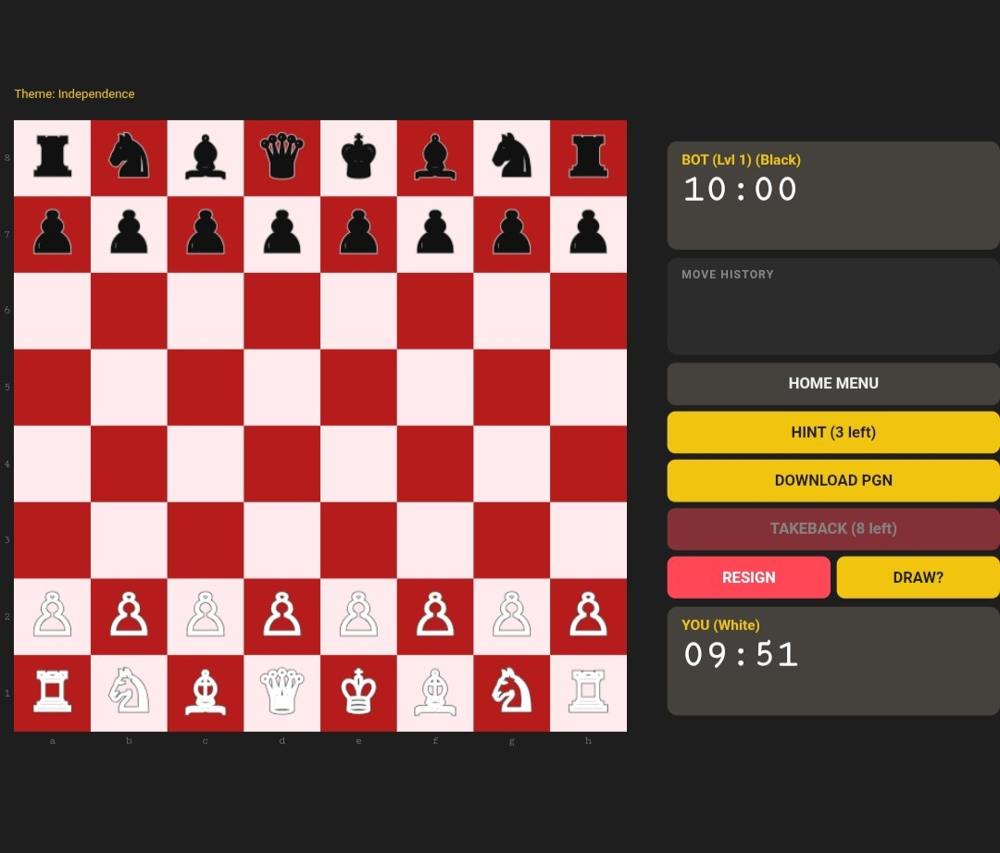

# OmniChess
An open-source chess project developed entirely in Python.



---

## Features
- **Stockfish Integration:** Engine-driven analysis and gameplay.
- **PGN Export:** Download games to analyze on chess.com or lichess.org.
- **Flexible Difficulty:** Multiple skill levels and custom ELO adjustment.
- **Time Control:** Customizable match duration.
- **Anti-Cheat:** Built-in system to monitor and flag unauthorized move assistance.
- **Error Logging:** Clear diagnostic messages to help with troubleshooting.
- **Cross-Platform:** Supports Windows (x86-64 and ARM64), Linux (x86-64 and ARM), and macOS (ARM).

---

## Prerequisites
- Python: https://www.python.org/downloads
- Stockfish Engine: https://stockfishchess.org/download/

---

## Installation
1. Clone or download this repository.
2. Open your terminal or command prompt in the project folder.
3. Install the required dependencies:
```bash
pip install -r requirements.txt
```

---

## Platform Setup

---

### 🪟 Windows x86-64

1. Download the **x86-64 AVX2** Stockfish binary from https://stockfishchess.org/download/
2. Place the binary in the same folder as `OmniChess-Windows-x86-64.py`.
3. Run the script:
```bash
python OmniChess-Windows-x86-64.py
```

---

### 🪟 Windows ARM64

1. Download the **ARM64** Stockfish binary from https://stockfishchess.org/download/
2. Place the binary in the same folder as `OmniChess-Windows-ARM64.py`.
3. Run the script:
```bash
python OmniChess-Windows-ARM64.py
```

---

### 🐧 Linux x86-64

1. Download the **Linux x86-64 AVX2** Stockfish binary from https://stockfishchess.org/download/
2. Place the binary in the same folder as `OmniChess-Linux-x86-64.py`.
3. Make it executable:
```bash
chmod +x stockfish-ubuntu-x86-64-avx2
```
4. Run the script:
```bash
python3 OmniChess-Linux-x86-64.py
```

---

### 🐧 Linux ARM (e.g. Raspberry Pi 5)

Stockfish does not provide official Linux ARM binaries, so you must compile it from source.

1. Install build dependencies:
```bash
sudo apt install git g++ make
```
2. Clone and compile Stockfish:
```bash
git clone https://github.com/official-stockfish/Stockfish.git
cd Stockfish/src
make -j4 build
```
3. Copy the compiled binary to the same folder as `OmniChess-Linux-ARM.py`:
```bash
cp stockfish /path/to/OmniChess-Linux-ARM.py/folder/
```
4. Run the script:
```bash
python3 OmniChess-Linux-ARM.py
```

---

### 🍎 macOS (Apple Silicon)

1. Download the **macOS Apple Silicon** Stockfish binary from https://stockfishchess.org/download/
2. Place the binary in the same folder as `OmniChess-MacOS-ARM.py`.
3. Remove the macOS quarantine flag and make it executable:
```bash
xattr -d com.apple.quarantine /path/to/stockfish-macos-m1-apple-silicon
chmod +x /path/to/stockfish-macos-m1-apple-silicon
```
4. If macOS still blocks it, go to **System Settings → Privacy & Security** and click **Allow Anyway**.
5. Run the script:
```bash
python3 OmniChess-MacOS-ARM.py
```

---

## Credits
Engine integration provided by the Stockfish Chess Engine authors.
